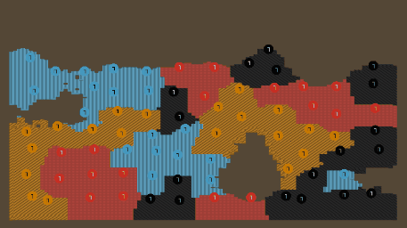
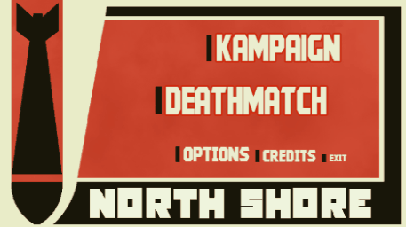

# North Shore

This game is all about learning enemy patterns and exploiting them to conquer the whole world.

It is inspired by the fights occured by the North and Baltic seas in Europe during WW2.

North Shore plays similarly to Risk but in a faster pace and focused only on conflict decisions. Troops are deplyed for you in specific places accordingly to the current extension of the war and the winner is who conquers all.

It is a singleplayer game that features four different artificial intelligences inspired by real WW2 leaders. The AI behaviour uniquely changes during the match.
Some will only counter attack in the early game and expand in the late game. Some will attack even in disadvantage and others will expand whenever they think they have an advantage.

North Shore also features fully procedurally generated maps. And three game modes:
Campaign - Fog of war and a slower pace of gameplay.
Deathmatch - Clear map and faster troop deployment.
AI Only - Same as deathmatch but faster and with no player input.

